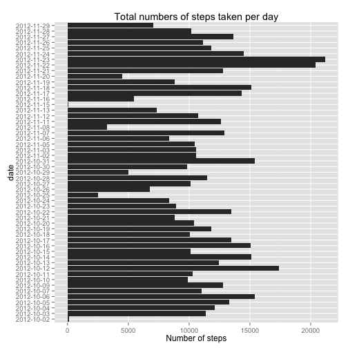
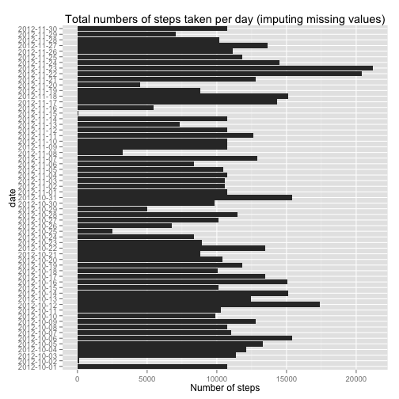
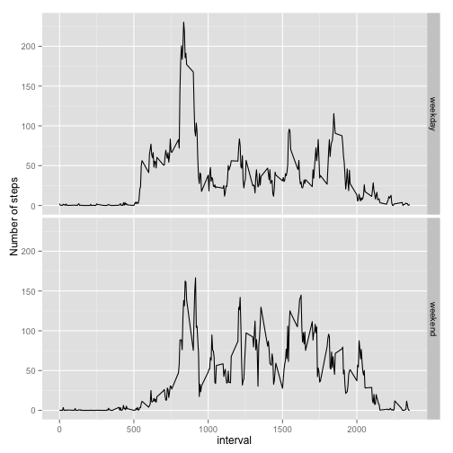

# Reproducible Research
##Peer Assesment 1

Assume our working directory contains the "activity.csv" file.

**Loading and preprocessing the data**


```r
# I had to set the working directory due to an error when trying to knit the html file
setwd("/Users/gjfelix/Documents/MOOCs/Data Science/Reproducible Research/Peer 1")
# Loading data
data <- read.csv("activity.csv")
```

The *date* variable is transformed using the *lubridate* package:


```r
library(lubridate) #Loads the lubridate package
data$date <- ymd(data$date)
```

**What is mean total number of steps taken per day?**

For this part of the assignment the missing values are ignored. From the dataset, the missing values (NAs) are removed, and the steps per days are obtained using tapply. 


```r
# Subsetting the original dataset (removing NAs)
dataNoNAs <- data[!is.na(data$steps),]

# Total steps per day are obtained
stepsPerDay <- tapply(dataNoNAs$steps, dataNoNAs$date, sum)

# Days are transformed to a factor variable
days <- factor(dataNoNAs$date)

# For simplicity a dataset containing these variables is created
dataPerDay <- data.frame(levels(days),stepsPerDay)
names(dataPerDay) <- c("date", "nSteps")
```

1. The histogram is created using *ggplot*


```r
library(ggplot2)
ggplot(data=dataPerDay, aes(x=date, y=nSteps)) + geom_bar(stat="identity")  + ggtitle("Total numbers of steps taken per day")+ylab("Number of steps") + coord_flip()
```

 


2. The mean and median of steps taken per day are:


```r
mean(dataPerDay$nSteps)
```

```
## [1] 10766.19
```

```r
median(dataPerDay$nSteps)
```

```
## [1] 10765
```

**What is the average daily activity pattern?**

1. To make the time series plot of the 5 minute interval and the average number of steps taken, averaged acrross all days:


```r
# To obtain the average steps for each interval
meanPerInt<-tapply(dataNoNAs$steps, dataNoNAs$interval, mean)

# Create the plot of "interval" vs average steps
plot(levels(factor(dataNoNAs$interval)), meanPerInt, type = "l", xlab = "Interval", ylab = "Average number of steps")
```

 

2. To determine which interval contains the maximum number of steps (averaged across all days) the function *which.max* function was used:


```r
# To obtain the index where the maximum number of steps is located
maxInd <- which.max(meanPerInt)

# The interval with the maximum number of steps is the obteined
meanPerInt[maxInd]
```

```
##      835 
## 206.1698
```

The last result indicates the the maximum number of steps (averaged across all days) occurs for the interval 835 (206 steps)

**Imputing missing values**

1. To calculate the total number of rows with NA's:


```r
sum(!complete.cases(data))
```

```
## [1] 2304
```

2 and 3. NA's in the dataset are replaced by the mean for the corresponding interval (the steps column is the only one containing NAs).


```r
dataNew<-c() #Empty list

# for each row in data
for(i in 1:dim(data)[1]){
  # Obtain the current interval
  int <- data$interval[i]
  # Determine if the value is NA. If TRUE, the value is replaced
  # by the correpsonding interval mean
  if(is.na(data$steps[i])){
    dataNew <- c(dataNew, mean(data$steps[data$interval == int], na.rm = TRUE))
  } else {
    # if the value is not NA, then the original value is used
    dataNew <- c(dataNew,data$steps[i])
  }
}

# Generate new dataset without NAs
data2 <- data.frame(dataNew, data$date, data$interval)

names(data2)<-names(data) # using the same names as in the original data
```

To check that the new data set does not include NAs:


```r
sum(!complete.cases(data2))
```

```
## [1] 0
```

4. Make a histogram of the total number of steps taken each day

```r
# Total steps per day are obtained
stepsPerDay2 <- tapply(data2$steps, data2$date, sum)

# Days are transformed to a factor variable
days2 <- factor(data2$date)

# For simplicity a dataset containing these variables is created
dataPerDay2 <- data.frame(levels(days2),stepsPerDay2)
names(dataPerDay2) <- c("date", "nSteps")
```

The histogram is created using *ggplot*:


```r
ggplot(data=dataPerDay2, aes(x=date, y=nSteps)) + geom_bar(stat="identity")  + ggtitle("Total numbers of steps taken per day (imputing missing values)" )+ylab("Number of steps") + coord_flip()
```

 

The mean and median for the new dataset are:


```r
mean(dataPerDay2$nSteps)
```

```
## [1] 10766.19
```

```r
median(dataPerDay2$nSteps)
```

```
## [1] 10766.19
```

It can be seen that when NAs were omitted from the analysis the mean and the median were different. On the other hand, when missing values were imputed, the same value was obtained.

**Are there differences in activity patterns between weekdays and weekends?**

1. Create a new factor variable in the dataset with two levels – “weekday” and “weekend” indicating whether a given date is a weekday or weekend day.


```r
# To determine the day from the date
wdays <- wday(data2$date)
wd <- c()
# If  monday - friday <- weekday, if saturday-sunday <- weekend
for (j in 1:length(wdays)){
  ifelse(wdays[j]>1 & wdays[j]<7,wd <- c(wd, "weekday"), wd <- c(wd, "weekend"))
}

# Append the column with the factor variable to the dataset
data2$weekday <- factor(wd)
# Convertint the interval variable in a factor variable
data2$interval<-factor(data2$interval)

# Description of the new dataset
str(data2)
```

```
## 'data.frame':	17568 obs. of  4 variables:
##  $ steps   : num  1.717 0.3396 0.1321 0.1509 0.0755 ...
##  $ date    : POSIXct, format: "2012-10-01" "2012-10-01" ...
##  $ interval: Factor w/ 288 levels "0","5","10","15",..: 1 2 3 4 5 6 7 8 9 10 ...
##  $ weekday : Factor w/ 2 levels "weekday","weekend": 1 1 1 1 1 1 1 1 1 1 ...
```

Panel plot containing a time series plot of the 5 minute interval axis and the average number of steps taken, averaged across all weekday days or weekend days. 


```r
# To obtain the mean value using both the interval and weekday as a factor
# mean per interval (meanPerInt)
meanPerInt2<-tapply(data2$steps, list(data2$interval,data2$weekday), mean)

# New dataset
mPInt2 <- data.frame(meanPerInt2[,1],meanPerInt2[,2],levels(data2$interval))
names(mPInt2)<-c("weekday","weekend","interval")

# The package "reshape" (melt) is used to obtain the final data
library(reshape)
mdata <- melt(mPInt2, id="interval")
head(mdata)
```

```
##   interval variable      value
## 1        0  weekday 2.25115304
## 2        5  weekday 0.44528302
## 3       10  weekday 0.17316562
## 4       15  weekday 0.19790356
## 5       20  weekday 0.09895178
## 6       25  weekday 1.59035639
```

```r
#Creating the time series (2 panels)
sp<-ggplot(data=mdata, aes(x=as.integer(as.character(interval)), y=value))+geom_line()
sp+facet_grid(variable ~ .)+ylab("Number of steps")+xlab("interval")
```

 


